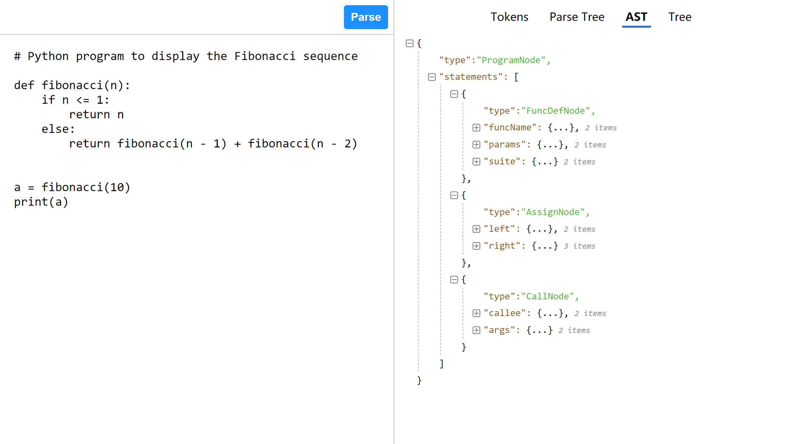
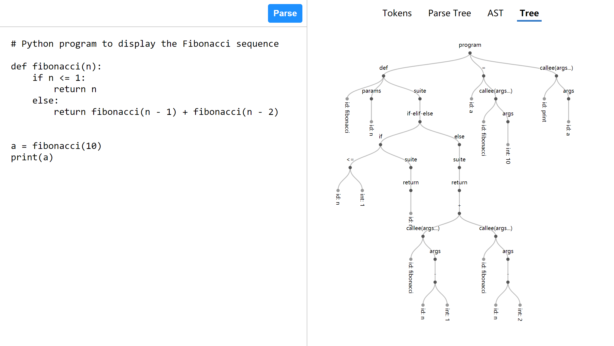

# Mini-Python Parser
编译原理大作业，一个“Mini-Python”语言的 Parser，可以在浏览器里运行并查看结果。

Mini-Python 的语法基于 Python 3.6 简化而来，文法定义详见[语法分析.md](./doc/parser/语法分析.md)。

如果本仓库对你有帮助，你可以给我点个 Star。( '▿' )

## 截图

## 流程
### 预处理
Python 带缩进的语法属于上下文有关文法，但是经过预处理后可以变为上下文无关文法：

- “缩进增”相当于其他语言的左花括号
- “缩进减”相当于右花括号
- “换行”相当于分号

此外，预处理器还会执行去除注释、去除空白行等操作。

### 词法分析
输入预处理后的代码，输出 token 序列。这里使用有限状态自动机（DFA）完成这个步骤。

Mini-Python 的词法定义详见[词法分析.md](./doc/scanner/词法分析.md)。

### 语法分析
输入 token 序列，输出分析树（Parse Tree）。这里使用递归下降方法完成这个步骤。

Mini-Python 的文法定义详见[语法分析.md](./doc/parser/语法分析.md)（使用 EBNF 表示）。

### 翻译
将分析树变换为抽象语法树（AST）。
