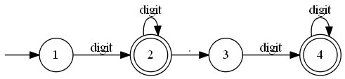
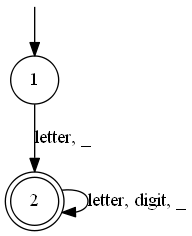
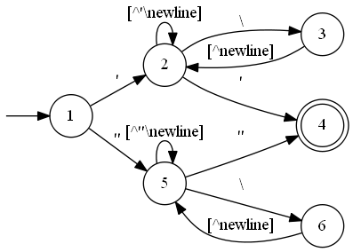
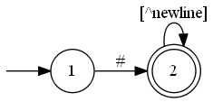
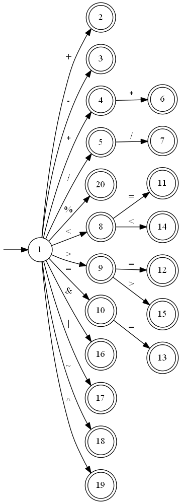
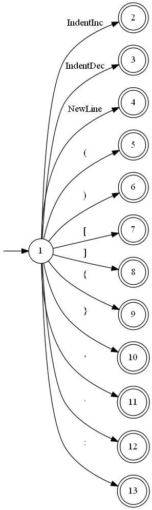
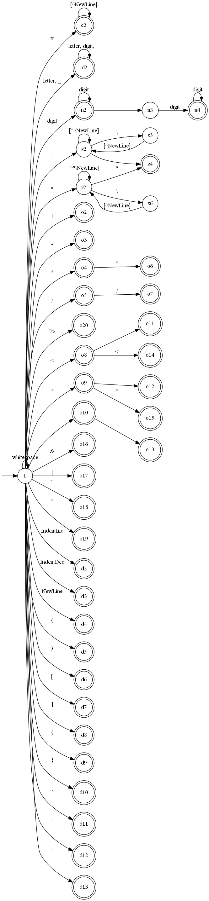

# 词法分析
## 数字
正则：`[0-9]+(\.[0-9]+)?`

## 标识符

## 关键字

- `def`
- `if`
- `else`
- `elif`
- `while`
- `return`
- `break`
- `continue`
- `and`
- `or`
- `not`
- `is`
- `True`
- `False`
- `None`
- `pass`
- `global`

## 字符串

## 注释
正则：`#[^newline]*`

## 运算符

- `<`
- `<=`
- `>`
- `>=`
- `==`
- `!=`
- `+`
- `-`
- `*`
- `/`
- `%`
- `**`
- `//`
- `<<`
- `>>`
- `&`
- `|`
- `~`
- `^`

## 分隔符

- `(`
- `)`
- `[`
- `]`
- `{`
- `}`
- `,`
- `:`
- `=`
- `.`
- newline
- indent increase
- indent decrease

## 合并

